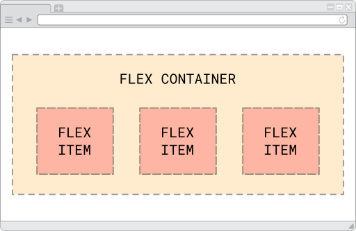
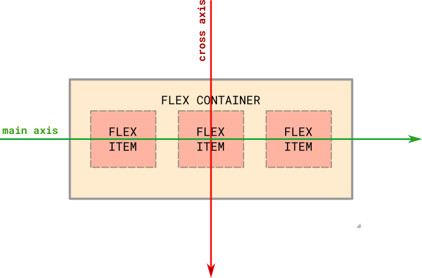

# Alineación de columnas
Gracias a la implementación de [Flexbox](https://www.w3.org/TR/css-flexbox-1/) en CSS3 y que Bootstrap 4 incorpora, ahora es posible -entre otras cuestiones- alinear las columnas tanto verticalmente como horizontalmete de forma sencilla. Se lleva así la maquetación web a un nuevo nivel, empleando cajas flexibles (de allí su nombre), evitando el uso de propiedades como `float`. 

## El modelo de Flexbox
Se basa en dos elementos: 

* El contenedor padre ó `flex container`
* El contenido hijo ó `flex items`

Veamos un ejemplo gráfico a continuación para comprender mejor el concepto: 



Y ahora, en un ejemplo real: 

```html
<!DOCTYPE html>
<html lang="es">

<head>
    <title>Flexbox</title>
    <meta charset="utf-8">
    <meta name="viewport" content="width=device-width, initial-scale=1">
    <meta http-equiv="x-ua-compatible" content="ie=edge">
    
    <style>
        .contenedor-flexbox {
            width: 400px;
            margin: 10px auto;
            border: 1px solid black;
            /* Uso de Flexbox */
            display: flex;
        }
        .caja1 {
            background-color: yellow;
            padding: 5px;
        }
        .caja2 {
            background-color: aquamarine;
            padding: 5px;
        }
        .caja3 {
            background: pink;
            padding: 5px;
        }
        .caja4 {
            background: skyblue;
            padding: 5px;
        }
    </style>
</head>
<body>
    <div class="contenedor-flexbox">
        <div class="caja1">Caja 1</div>
        <div class="caja2">Caja 2</div>
        <div class="caja3">Caja 3</div>
        <div class="caja4">Caja 4</div>
    </div>
</body>
</html>
```

[[¡Intentalo!]](descargas/bootstrap_flexbox_ej_1.zip) &nbsp;&nbsp; [[Solución]](descargas/bootstrap_flexbox_sc_1.zip) 

Además, la alineación de los hijos se realiza sobre unos ejes -principal y secundario-: 



La imagen de arriba ilustra el comportamiento de los ejes por defecto. 

Sin embargo, tanto el eje principal (main) como el secundario (cross) pueden invertirse mediante clases de Flexbox. Veamos un ejemplo: 

```html
<!DOCTYPE html>
<html lang="es">

<head>
    <title>Flexbox</title>
    <meta charset="utf-8">
    <meta name="viewport" content="width=device-width, initial-scale=1">
    <meta http-equiv="x-ua-compatible" content="ie=edge">
    
    <style>
        .contenedor1 {
            width: 400px;
            margin: 10px auto;
            border: 1px solid black;
            /* Uso de Flexbox */
            display: flex;
            flex-direction: row;
        }
        .contenedor2 {
            width: 400px;
            margin: 10px auto;
            border: 1px solid black;
            /* Uso de Flexbox */
            display: flex;
            flex-direction: row-reverse;
        }
        .contenedor3 {
            width: 400px;
            margin: 10px auto;
            border: 1px solid black;
            /* Uso de Flexbox */
            display: flex;
            flex-direction: column;
        }
        .contenedor4 {
            width: 400px;
            margin: 10px auto;
            border: 1px solid black;
            /* Uso de Flexbox */
            display: flex;
            flex-direction: column-reverse;
        }
        .caja1 {
            background-color: yellow;
            padding: 5px;
        }
        .caja2 {
            background-color: aquamarine;
            padding: 5px;
        }
        .caja3 {
            background: pink;
            padding: 5px;
        }
        .caja4 {
            background: skyblue;
            padding: 5px;
        }
    </style>
</head>
<body>
    <div class="contenedor1">
	    <div class="caja1">Caja 1</div>
        <div class="caja2">Caja 2</div>
        <div class="caja3">Caja 3</div>
        <div class="caja4">Caja 4</div>
    </div>
    <div class="contenedor2">
	    <div class="caja1">Caja 1</div>
        <div class="caja2">Caja 2</div>
        <div class="caja3">Caja 3</div>
        <div class="caja4">Caja 4</div>
    </div>
    <div class="contenedor3">
	    <div class="caja1">Caja 1</div>
        <div class="caja2">Caja 2</div>
        <div class="caja3">Caja 3</div>
        <div class="caja4">Caja 4</div>
    </div>
    <div class="contenedor4">
	    <div class="caja1">Caja 1</div>
        <div class="caja2">Caja 2</div>
        <div class="caja3">Caja 3</div>
        <div class="caja4">Caja 4</div>
    </div>
</body>
</html>
```

[[¡Intentalo!]](descargas/bootstrap_flexbox_axis_ej_1.zip) &nbsp;&nbsp; [[Solución]](descargas/bootstrap_flexbox_axis_sc_1.zip) 

!!! info "Bootstrap y Flexbox"
        En este curso sólo describiremos algunas propiedades de Flexbox (colo el ordenamiento de las cajas). Estas propiedades fueron incorporadas en Bootstrap 4. Sin embargo, existen muchas otras propiedades que no serán incluidas en esta guía. 

