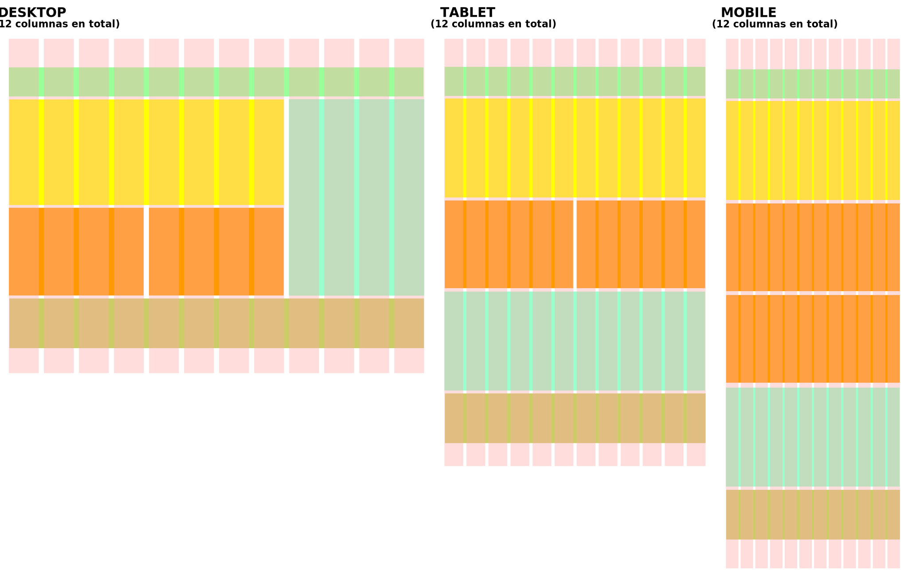
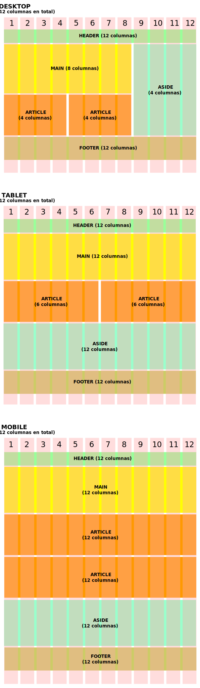
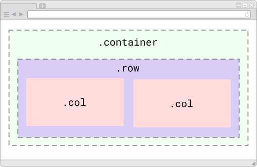
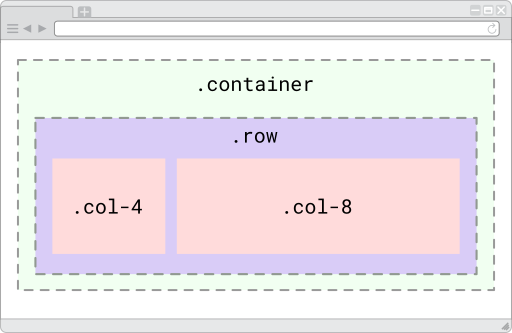
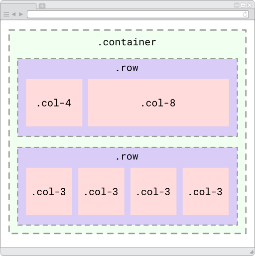

# Entendiendo la grid de Bootstrap
Bootstrap posee un sistema de rejilla, también conocida como _grid_, que nos permite maquetar fácilmente cualquier sitio web y, lo que es mejor, apelando a los principios del _responsive web design_: esto quiere decir que diseñamos nuestro sitio por única vez, y este se adaptará como por arte de magia, a la pantalla de diferentes dispositivos. 

##Ejemplos de _grid_ para distintas pantallas

Como habrás podido pareciar al observar los ejemplos, en cualquier caso, 12 son las columnas que estructuran el contenido de la página web, sin importar de cuál dispositivo se trate: lo que **cambia entre las distintas pantallas es la cantidad de columnas que utiliza cada sección de contenido** y esto es, precisamente, lo que definiremos al emplear este _framework_. 

## Puntos de corte
Bootstrap emplea _media queries_ de CSS para establecer los puntos de corte que determinan ĺos límites entre un tipo de pantalla y otra. 

| Nombre      | Límites                  | Dispositivo de ejemplo    | Nombre de la clase |
| ----------- | ------------------------ | ------------------------- | ------------------ |
| Extra small | Menor que 576px          | Celular (vertical)        | `.col`             |
| Small       | Igual o mayor que 576px  | Celular (horizontal)      | `.col-sm`          |
| Medium      | Igual o mayor que 768px  | Tablet (vertical)         | `.col-md`          |
| Large       | Igual o mayor que 992px  | Tablet (horizontal)       | `.col-lg`          |
| Extra large | Igual o mayor que 1200px | Computadora, TV, etc      | `.col-xl`          |

!!! info "El número de columnas de la grid"
		La _grid_ de Bootstrap ofrece 12 columnas como máximo (no es necesario usar todas) para cada tamaño de pantalla. Cada columna posee un espaciado (espacio en "blanco") de 15px a cada lado, es decir, 30px en total. 

## Contenedor
El contenedor (o del inglés, _container_) se trata de una clase que debe añadirse a un elemento en bloque, generalmente un  `div` y que contiene -valga la redundancia- el contenido de la página web. Existen dos tipos de clases para un contenedor: 

`container`: ocupa el centro del ancho de la pantalla con espacios iguales a cada lado

`.container-fluid` ocupa el 100% del ancho de la pantalla del dispositivo  

## Filas
Una fila (o del inglés, _row_) se trata de una clase que debe añadirse a un elemento en bloque, generalmente un  `div` el cual debe estar dentro de un bloque con la clase `.container`. 

Sin embargo no debe agregarse contenido directamente dentro de una fila. 

## Columnas
Las columnas (del inglés _column_) se trata de una clase ...

## Combinando 

