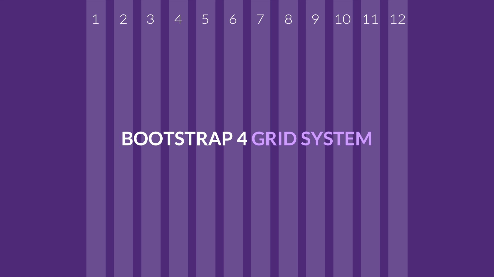

# El sistema de rejilla o _Grid system_ de Bootstrap
En los inicios de internet, los diversos elementos que conforman una página web se organizaban empleando tablas HTML. Más tarde, el uso de tablas se dejó de lado por las cajas flotantes CSS. Al día de hoy, con la llegada de CSS 3, los diseñadores web hacen uso del módulo Flexbox CSS. Botstrap toma lo mejor de este módulo y le suma un conjunto de "buenas prácticas" de diseño que confluyen en el poderoso sistema de rejilla o _grid_.

## ¿En qué consiste la _grid_ de Bootstrap?
Básicamente consiste en 12 columnas que se emplean a modo de guías "invisibles" para ubicar los distintos elementos de una página web. 

## Ventajas del sistema de rejilla a la hora de maquetar 
El sistema de rejilla o _grid_ que proporciona el _framework_ Bootstrap permite:

* distribuir los elementos del sitio web fácilmente (maquetación del sitio web)

* crear un único sitio web que, empezando por la pantalla de un móvil, se adapte de manera "inteligente" a las pantallas de los distintos dispositivos. Esta técnica se conoce también como [diseño web responsivo o _responsive web design_](http://diseñowebresponsive.org/?utm_source=redirects&utm_medium=dise%25C3%25B1owebresponsivo.com.ar). 

_Imagen: credofy.com_