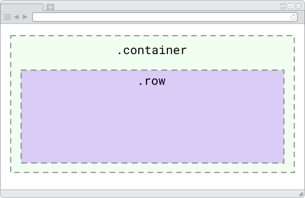

# Reglas
Es preciso seguir una serie de reglas para emplear adecuadamente la _grid_ y demás elementos ofrecidos por Bootstrap, las cuales podrían resumirse de modo general en: 

* Bootstrap ofrece unas clases CCS predeterminadas para formar su _grid_
* Las clases deben emplearse en [elementos en bloque](https://developer.mozilla.org/es/docs/Web/HTML/Block-level_elements) (generalmente `div`)
* El elemento padre, llamado contenedor, debe llevar la clase `.container*`
* Dentro de cada contenedor deben ubicarse las filas, mediante la clase `.row*`
* Dentro de una fila deben incluirse las columnas, mediante la clase `.col*`
* No es posible incluir contenido directamente dentro de un contenedor, ni dentro de las filas: sólo las columnas pueden alojar contenido. 
* No hay límite -teórico- para el número de contenedores, filas y columnas

A continuación, profundicemos estas reglas mediante ejemplos visuales. 

## Contenedor
Bootstrap porporciona dos tipos de clase CSS para los contenedores: 

`container`: ocupa el centro del ancho de la pantalla con espacios iguales a cada lado


`.container-fluid`: ocupa el 100% del ancho de la pantalla del dispositivo 


Las clases para contenedor deben añadirse a un elemento en bloque, generalmente un  `div`, para formar un contenedor. 

!!!error "Contenedores y contenido web"
		Como indicamos más arriba, los contenedores no pueden alojar contenido web directamente. 

## Filas
La clase CSS para una fila `.row*` debe añadirse a un elemento en bloque, generalmente un  `div`, para formar una fila. Las filas debe estar dentro de un elemento en bloque con la clase `.container*`



!!!error "Filas y contenido web"
		Al igual que los contenedores, las filas tampoco pueden alojar contenido web directamente dentro suyo. 

## Columnas
La clase CSS para una columna `.col*` debe añadirse a un elemento en bloque, generalmente un  `div`, para formar una columna. Las columnas deben ubicarse siempre dentro de una fila. 


En el ejemplo anterior, el ancho de cada columna se establece de manera automática: 

```html
<!DOCTYPE html>
<html lang="es">
<head>
	<meta charset="UTF-8">
	<meta name="viewport" content="width=device-width, initial-scale=1.0">
	<link rel="stylesheet" href="css/bootstrap.min.css">
</head>
<body>

<div class="container">
	<div class="row">
		<div class="col"><!--Contenido web--></div>
		<div class="col"><!--Contenido web--></div>
	</div>
</div>

<script src="js/bootstrap.min.js"></script>
<script src="js/jquery-3.3.1.min.js"></script>
<script src="js/popper.min.js"></script>
	
</body>
</html>
```


!!!done "Columas y contenido web"
		Las columnas son los únicos elementos que pueden alojar directamente contenido web. 

Adicionalmente puede determinarse el ancho de cada columna, indicando la cantidad de columnas de la _grid_ para cada una de ellas, como puede visualizase en el siguiente ejemplo: 


Y el código del ejemplo: 

```html
<!DOCTYPE html>
<html lang="es">
<head>
	<meta charset="UTF-8">
	<meta name="viewport" content="width=device-width, initial-scale=1.0">
	<link rel="stylesheet" href="css/bootstrap.min.css">
</head>
<body>

<div class="container">
	<div class="row">
		<div class="col-4"><!--Contenido web--></div>
		<div class="col-8"><!--Contenido web--></div>
	</div>
</div>

<script src="js/bootstrap.min.js"></script>
<script src="js/jquery-3.3.1.min.js"></script>
<script src="js/popper.min.js"></script>
	
</body>
</html>
```


## Más ejemplos del uso de la _grid_
A continuación se presentan algunos ejemplos de combinación de contenedores, filas y columnas en la _grid_ de Bootstrap.

### Rejilla con varias filas


```html
<!DOCTYPE html>
<html lang="es">
<head>
	<meta charset="UTF-8">
	<meta name="viewport" content="width=device-width, initial-scale=1.0">
	<link rel="stylesheet" href="css/bootstrap.min.css">
</head>
<body>

<div class="container">
	<div class="row">
		<div class="col-4"><!--Contenido web--></div>
		<div class="col-8"><!--Contenido web--></div>
	</div>
	<div class="row">
		<div class="col-3"><!--Contenido web--></div>
		<div class="col-3"><!--Contenido web--></div>
		<div class="col-3"><!--Contenido web--></div>
		<div class="col-3"><!--Contenido web--></div>
	</div>
</div>

<script src="js/bootstrap.min.js"></script>
<script src="js/jquery-3.3.1.min.js"></script>
<script src="js/popper.min.js"></script>
	
</body>
</html>
```


### Rejilla con varios contenedores


```html
<!DOCTYPE html>
<html lang="es">
<head>
	<meta charset="UTF-8">
	<meta name="viewport" content="width=device-width, initial-scale=1.0">
	<link rel="stylesheet" href="css/bootstrap.min.css">
</head>
<body>

<div class="container-fluid">
	<div class="row">
		<div class="col-12"><!--Contenido web--></div>
	</div>
</div>
<div class="container">
	<div class="row">
		<div class="col-4"><!--Contenido web--></div>
		<div class="col-8"><!--Contenido web--></div>
	</div>
	<div class="row">
		<div class="col-3"><!--Contenido web--></div>
		<div class="col-3"><!--Contenido web--></div>
		<div class="col-3"><!--Contenido web--></div>
		<div class="col-3"><!--Contenido web--></div>
	</div>
</div>

<script src="js/bootstrap.min.js"></script>
<script src="js/jquery-3.3.1.min.js"></script>
<script src="js/popper.min.js"></script>
	
</body>
</html>
```

