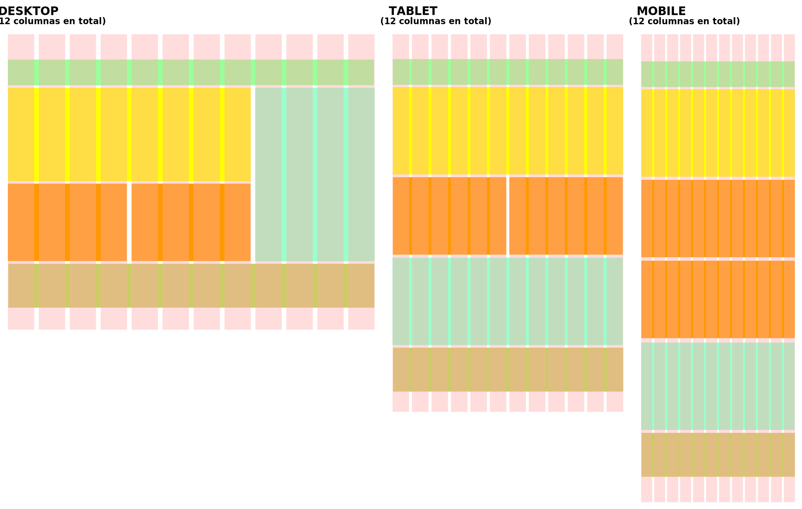
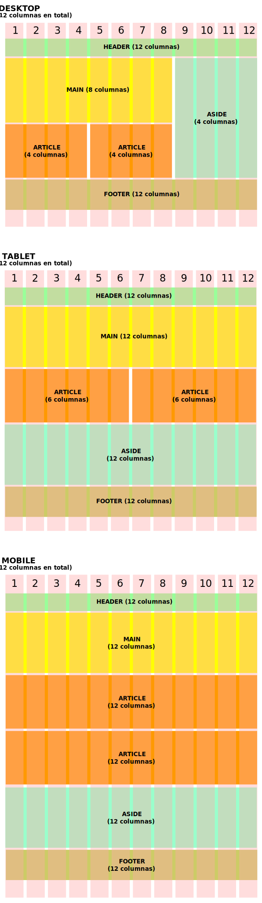

# Diseño web adaptable o _Responsive web design_
La _grid_ de Bootstrap emplea el poder las las [_media queries_](https://developer.mozilla.org/es/docs/CSS/Media_queries) de CSS para establecer de qué manera el contenido se organizará en los distintos dispositivos. Sin embargo, no deja librada la tarea de organizar las _media queries_ al diseñador: ofrece unas clases CSS predefinidas que harán el trabajo por él. 

## ¿Cómo funciona el diseño adaptable?

Imaginemos por un momento un sitio web cualquiera y como diseñadores necesitamos que el contenido del mismo se visualice bien en cualquier dispositivo. Utilizando la _grid_ de Bootstrap podremos lograrlo. Prestemos atención al siguiente ejemplo visual y particularmente a las cajas de colores que representan las distintas secciones de contenido del sitio web: 



Si observamos con atención atención a la imagen anterior habremos apreciado como el contenido del sitio web (representado por las cajas de colores) se "reorganizó" para conseguir una mejor visualización dependiendo de la pantalla de cada dispositivo: _Desktop_ (Pc de escritorio), Tablet y _Mobile_ (Celular). Para cualquier caso, la _grid_ ofrece 12 columnas para organizar el contenidos. 

## Puntos de corte
Para que el contenido de un sitio web sea adaptable, es decir, capaz de "reorganizarse" para mostrarse de la mejor manera en cada dispositivo, Bootstrap establece ciertos "puntos de corte" mediante el uso de clases CSS que establecen los límites entre un tipo de pantalla y otra. 

| Nombre      | Límites                  | Dispositivo de ejemplo    | Nombre de la clase |
| ----------- | ------------------------ | ------------------------- | ------------------ |
| Extra small | Menor que 576px          | Celular (vertical)        | `.col`             |
| Small       | Igual o mayor que 576px  | Celular (horizontal)      | `.col-sm`          |
| Medium      | Igual o mayor que 768px  | Tablet (vertical)         | `.col-md`          |
| Large       | Igual o mayor que 992px  | Tablet (horizontal)       | `.col-lg`          |
| Extra large | Igual o mayor que 1200px | Computadora, TV, etc      | `.col-xl`          |

!!! info "Columnas y espaciado"
		La _grid_ de Bootstrap ofrece 12 columnas como máximo (no es necesario usar todas) para cada tamaño de pantalla. Cada columna posee un espaciado (espacio en "blanco") de 15px a cada lado, es decir, 30px en total. 

Retomemos el ejemplo gráfico del inicio -ahora para cada tipo de pantala- para comprender mejor el funcionamiento de las _media queries_:



En todo los ejemplos se han utilizado etiqueteas semánticas HTML como `header`, `main`, `aside`, `article` y `footer` para organizar el contenido del hipotético sitio web. 

!!!warning "Diseño adaptable y Grid"
		Utilizar la _grid_ de Bootstrap, [como se mostró en una sección anterior](gridReglas.md), no es sinónimo de crear un sitio web adaptable. Para crear un sitio _responsivo_ es necesario incluir las clases que Bootstrap dispone para tal fin.  

## ¡Manos a la obra!
Seguimos profundiazando en el concepto de diseño adaptable, ahora, mediante el estudio de algunos ejemplos donde se emplean las clases _responsivas_ proporcionadas por Bootstrap. 

**NOTA: En los ejemplos se han agregado estilos para visualizar mejor los elementos de la página**

Veamos un ejemplo donde tenemos 4 columnas de contenido que se adaptarán al tamaño de la pantalla: 

```html
<!DOCTYPE html>
<html lang="es">
<head>
    <meta charset="UTF-8">
    <meta name="viewport" content="width=device-width, initial-scale=1.0">
    <link rel="stylesheet" href="css/bootstrap.min.css">

    <!-- Estilos extra (para visualizar mejor el ejemplo) -->
    <style>
    	.row > div {background-color: #f9f9f9; border: 1px solid #333; margin: 5px 0;}
    </style>
</head>
<body>
	
	<!-- Estilos extra (para visualizar mejor el ejemplo) -->
	<div class="container">
		<div class="row">
			<h3 class="d-block d-sm-none">Extra small (<576px)</h3>
	    	<h3 class="d-none d-sm-block d-md-none">Small (≥576px)</h3>
	    	<h3 class="d-none d-md-block d-lg-none">Medium (≥768px)</h3>
	    	<h3 class="d-none d-lg-block d-xl-none">Large (≥992px)</h3>
	    	<h3 class="d-none d-xl-block">Extra large (≥1200px)</h3>
		</div>
	</div>

	<!-- Clases de Bootstrap para diseño web adaptable -->
	<div class="container">
	    <div class="row">
	        <div class="col-12 col-sm-6 col-md-6 col-lg-8 col-xl-3">
	            <p>COL 1</p>
	        </div>

	        <div class="col-12 col-sm-6 col-md-6 col-lg-4 col-xl-3">
	            <p>COL 2</p>
	        </div>

	        <div class="col-12 col-sm-12 col-md-6 col-lg-8 col-xl-3">
	            <p>COL 3</p>
	        </div>
	        <div class="col-12 col-sm-12 col-md-6 col-lg-4 col-xl-3">
	            <p>COL 4</p>
	        </div>
	    </div>
	</div>

	<script src="js/bootstrap.min.js"></script>
	<script src="js/jquery-3.3.1.min.js"></script>
	<script src="js/popper.min.js"></script>

</body>
</html>
```

[[ Descargá el ejemplo ]](descargas/bootstrap_web_adaptable_1.zip)

Donde podemos observar lo siguiente: 

* El **número clave es 12**: si la suma de los anchos de las columnas no supera este número, las mismas se ubicarán en una misma línea; en caso contrario, se dispondrán un una nueva línea. 
* Tamaño extra pequeño (`.col`): las cuatro columnas de contenido abarcan un total de 12 columnas de la grid (`col-12`)
* Tamaño pequeño (`.col-sm`): las dos primeras columnas de contenido abarcan 6 columnas de la _grid_ (`col-sm-6`) y las dos restantes, 12 columnas de la _grid_ (`col-sm-12`)
* Tamaño mediano (`.col-md`): las cuatro columnas de contenido abarcan 6 columnas de la _grid_ (`col-md-6`)
* Tamaño grande (`.col-lg`): la primera y tercer columna de contenido abarcan 8 columnas de la _grid_ (`col-lg-8`) y las columnas segunda y cuarta abarcan cuatro columnas de la _grid_ (`col-lg-4`)


Podemos, incluso, agregar algunos contenedores más y aplicar las clases _responsivas_ en el contenido de cada uno de ellos: 

```html
<!DOCTYPE html>
<html lang="es">
<head>
    <meta charset="UTF-8">
    <meta name="viewport" content="width=device-width, initial-scale=1.0">
    <link rel="stylesheet" href="css/bootstrap.min.css">
    <!-- Estilos extra (para visualizar mejor el ejemplo) -->
    <style>
    	.row > div {background-color: #f9f9f9; border: 1px solid #333; margin: 5px 0;}
    </style>
</head>
<body>

	<div class="container">
	    <div class="row">
	        <div class="col-12 col-sm-2">
	            <p>LOGO</p>
	        </div>
	        <div class="col-12 col-sm-10">
	            <p>NAVEGACION</p>
	        </div>
	    </div>
	</div>

    <div class="container">
        <div class="row">
            <div class="col-12 col-sm-6 col-md-6 col-lg-8 col-xl-3">
                <p>COL 1</p>
            </div>

            <div class="col-12 col-sm-6 col-md-6 col-lg-4 col-xl-3">
                <p>COL 2</p>
            </div>

            <div class="col-12 col-sm-12 col-md-6 col-lg-8 col-xl-3">
                <p>COL 3</p>
            </div>
            <div class="col-12 col-sm-12 col-md-6 col-lg-4 col-xl-3">
                <p>COL 4</p>
            </div>
        </div>
    </div>

	<div class="container">
	    <div class="row">
	        <div class="col-12 col-lg-6">
	            <p>PIE 1</p>
	        </div>
	        <div class="col-12 col-lg-6">
	            <p>PIE 2</p>
	        </div>
	    </div>
	</div>

	<script src="js/bootstrap.min.js"></script>
	<script src="js/jquery-3.3.1.min.js"></script>
	<script src="js/popper.min.js"></script>

</body>
</html>
```

[[ Descargá el ejemplo ]](descargas/bootstrap_web_adaptable_2.zip)

Finalmente, dejamos a disposición ejemplos reales de sitios webs _responsivos_ listos para descargar y "jugar": 

* [[ Descarga de sitio web adaptable 1 ]](descargas/theme_app_starter.zip)
* [[ Descarga de sitio web adaptable 2 ]](descargas/theme_landing.zip)