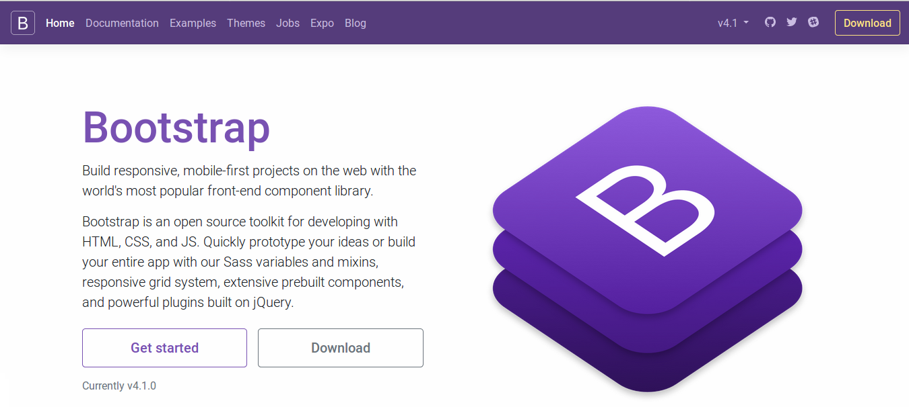
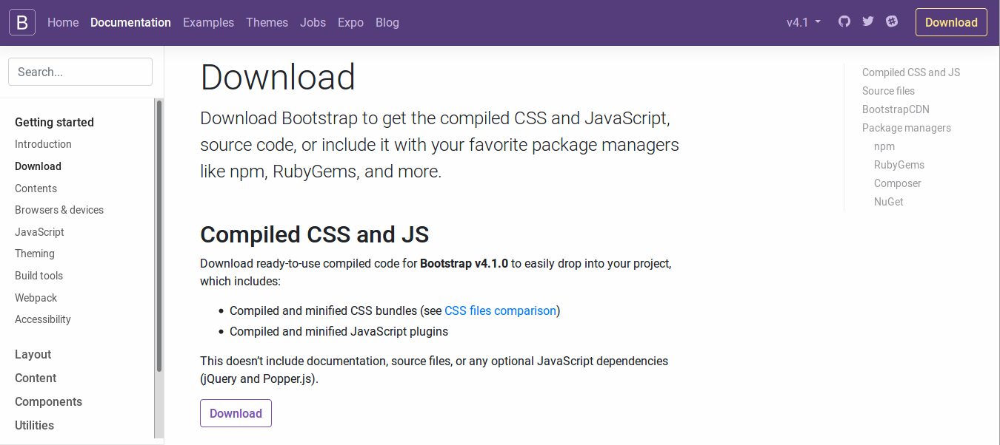
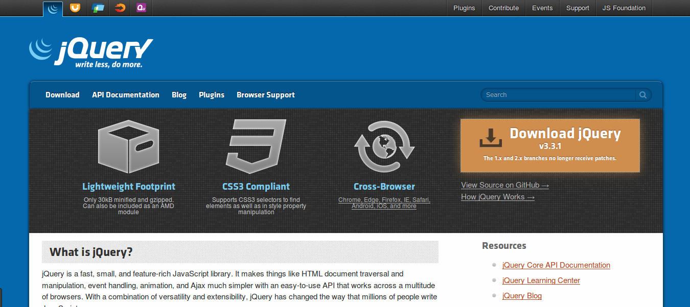
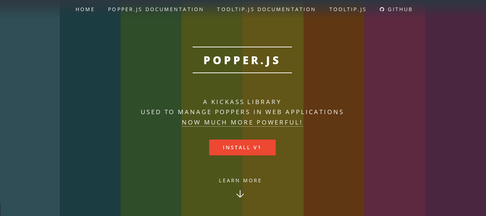

# Primeros pasos

Comenzar a trabajar con Bootstrap es muy sencillo, simplemente debemos descargar los archivos del proyecto y configurar nuestra plantilla inicial para comenzar a trabajar. 

!!! info "Versiones utilizadas"
		Las versiones de Bootstrap se actualizan constantemete, al igual que los componentes que esta herramienta utiliza. Al momento de escribir esta guía se emplean las siguientes versiones: 

		* [Bootstrap](https://getbootstrap.com/): 4.1
		* [jQuery](https://jquery.com/): 3.3.1
		* [Popper.js](https://popper.js.org/): 1.14.3


## Descargando Bootstrap
Para descargar el _framework_ sencillamente nos dirigimos a su página principal **[getbootstrap.com](https://getbootstrap.com/)** y hacemos clic sobre el botón **_Donwload_**:



Se nos redigirá a una página con múltiples opciones de descarga. Elegimos la opción **_Compiled CSS and JS_**:



Obtendremos un archivo llamado **bootstrap-4.1.0-dist.zip** (dependiendo de la versión de Bootstrap) que al descomprimir tendremos: 

```
bootstrap-4.1.0-dist
├── css
│   ├── bootstrap.css
│   ├── bootstrap.css.map
│   ├── bootstrap-grid.css
│   ├── bootstrap-grid.css.map
│   ├── bootstrap-grid.min.css
│   ├── bootstrap-grid.min.css.map
│   ├── bootstrap.min.css
│   ├── bootstrap.min.css.map
│   ├── bootstrap-reboot.css
│   ├── bootstrap-reboot.css.map
│   ├── bootstrap-reboot.min.css
│   └── bootstrap-reboot.min.css.map
└── js
    ├── bootstrap.bundle.js
    ├── bootstrap.bundle.js.map
    ├── bootstrap.bundle.min.js
    ├── bootstrap.bundle.min.js.map
    ├── bootstrap.js
    ├── bootstrap.js.map
    ├── bootstrap.min.js
    └── bootstrap.min.js.map
```

A partir de ahora, nos referiremos a esta carpeta y sus componentes como **carpeta de proyecto**. 

## Descargando librerías
Como mencionamos al comienzo, Bootstrap trabaja en conjunto con otras librerías o componentes para agregar funcionalidad a la página web. Dichas librerías están basadas en Javascript y son [jQuery](https://jquery.com/) y [Popper.js](https://popper.js.org/). 

### ¿Cómo descargar?
Antes de comenzar la descargar de las librerías conviene aclarar que ambas son de tipo Javascript. Es decir, son archivos de texto plano -con extensión _.js_-: al hacer clic para intentar descargarlos, los mismos se abrirán en nuestro navegador web. Para descargarlas, podemos elegir entre: 

* Ejecutar la combinación de teclas `Ctrl + s` de nuestro teclado, o bien
* Hacer clic derecho sobre el cuerpo de la página y seleccionar la opción **"Guardar como..."** (Google Chrome) ó **"Guardar página cómo..."** (Mozilla Firefox) del menú contextual. 

### jQuery
Para descargar esta librería, simplemente nos dirigimos al sitio web de jQuery y hacemos clic sobre el botón **_Download jQuery_**:



Dicha acción nos redirigirá a una página conteniendo varios enlaces de descarga. Elegiremos **_Download the compressed, production jQuery 3.3.1_** (el número de versión puede variar). 

**IMPORTANTE: Deberemos guardar el archivo descargado `jquery-3.3.1.min.js` dentro de la carpeta `js` de nuestro proyecto.**

### Popper.js
Al igual que con jQuery, nos dirigimos a la página oficial de la librería **[popper.js.org](https://popper.js.org/)** y hacemos clic sobre el botón **_INSTALL V1_** (el número de versión puede variar):




Seremos redirigidos a una página con múltiples opciones de descarga. Buscamos en la columna _Source_ de la tabla, la opción **_unpkg, minified_** y hacemos clic sobre el enlace en cuestión: [https://unpkg.com/popper.js/dist/umd/popper.min.js](https://unpkg.com/popper.js/dist/umd/popper.min.js).

**IMPORTANTE: Deberemos guardar el archivo descargado `popper.min.js` dentro de la carpeta `js` de nuestro proyecto**. 

## Creando nuestra primera página

Crearemos una archivo HTML llamdo `index.html` y lo guardaremos **dentro de la carpeta de nuestro proyecto**. Si seguimos los pasos anteriores de manera correcta, el contenido de la carpeta de nuestro proyecto debería verse de manera similar a la que sigue (agregamos una carpeta llamada `img` para alojar las imágenes del proyecto en un futuro):  


```bash
bootstrap-4.1.0-dist/
├── css
│   ├── bootstrap.css
│   ├── bootstrap.css.map
│   ├── bootstrap-grid.css
│   ├── bootstrap-grid.css.map
│   ├── bootstrap-grid.min.css
│   ├── bootstrap-grid.min.css.map
│   ├── bootstrap.min.css
│   ├── bootstrap.min.css.map
│   ├── bootstrap-reboot.css
│   ├── bootstrap-reboot.css.map
│   ├── bootstrap-reboot.min.css
│   └── bootstrap-reboot.min.css.map
├── img
├── index.html
└── js
    ├── bootstrap.bundle.js
    ├── bootstrap.bundle.js.map
    ├── bootstrap.bundle.min.js
    ├── bootstrap.bundle.min.js.map
    ├── bootstrap.js
    ├── bootstrap.js.map
    ├── bootstrap.min.js
    ├── bootstrap.min.js.map
    ├── jquery-3.3.1.min.js
    └── popper.min.js

```

Luego, abrimos el archivo `index.html` con nuestro editor favorito y escribimos: 

```html
<!DOCTYPE html>
<html lang="es">
<head>
	
	<meta charset="UTF-8">
	<meta name="viewport" content="width=device-width, initial-scale=1.0">
	<link rel="stylesheet" href="css/bootstrap.min.css">
	<title>Plantilla Bootstrap 4.1</title>

</head>
<body>

	<h1>Bootstrap 4.1</h1>

<script src="js/bootstrap.min.js"></script>
<script src="js/jquery-3.3.1.min.js"></script>
<script src="js/popper.min.js"></script>
	
</body>
</html>
```

Tendremos todo lo necesario para comenzar nuestro proyecto web basándonos en el _framework_ Bootrap. 

!!!done "Descarga de la plantilla Bootstrap"
        [Carpeta de proyecto Bootstrap (Plantilla)](ejemplos/bootstrap_4.1.0_plantilla.zip)


