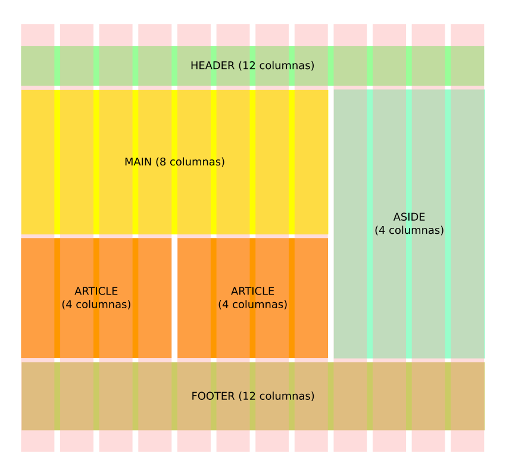
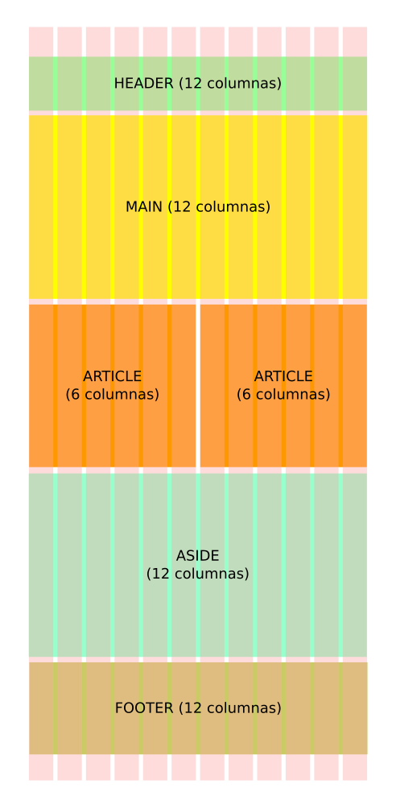
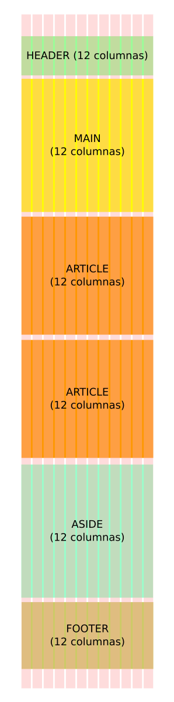

El framework Bootstrap está desarrollado según los preceptos de la corriente _Mobile First_ es decir, con el desarrollo para móviles como punto de partida. Esto permite crear un único sitio que, empezando por la pantalla de un móvil, se adapte de manera "inteligente" a las pantallas de los distintos dispositivos. Esta técnica se conoce también como [diseño web responsivo](http://diseñowebresponsive.org/?utm_source=redirects&utm_medium=dise%25C3%25B1owebresponsivo.com.ar). 

_Fuente: credofy.com_

## La grid de Bootstrap
Bootstrap posee un sistema de rejilla, también conocida como _grid_, que nos permite maquetar fácilmente cualquier sitio web y, lo que es mejor, apelando a los principios del _responsive web design_: esto quiere decir que diseñamos nuestro sitio por única vez, y este se adaptará como por arte de magia, a la pantalla de diferentes dispositivos. 

Para cumplir con tan ambioso cometido, Bootstrap utiliza un sistema de rejilla compuesto por **12 columnas**. Para entender mejor esto, veamos un ejemplo visual para distintas pantallas (en los ejemplos, las columnas aparecen como bastones de color salmón):

###Pantalla de una PC de escritorio

###Pantalla de una tablet 

###Pantalla de un celular

Como habrás podido pareciar al observar los ejemplos, en cualquier caso, 12 son las columnas que estructuran el contenido de la página web, sin importar de cuál dispositivo se trate: lo que **cambia entre las distintas pantallas es la cantidad de columnas que utiliza cada sección de contenido** y esto es, precisamente, lo que definiremos al emplear este _framework_. 

