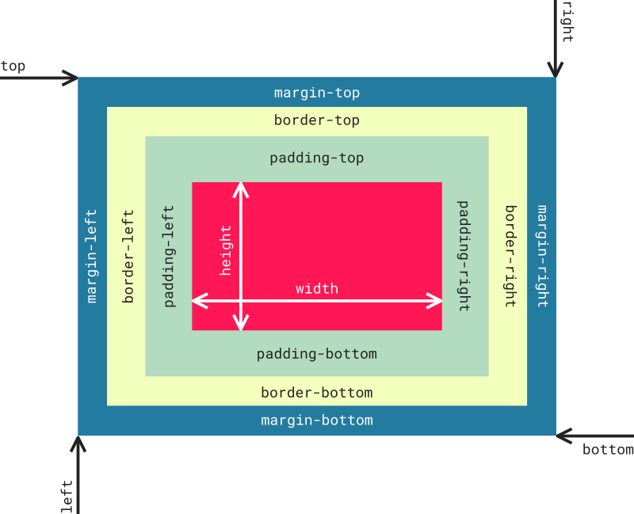

# El modelo de caja

Para comprender qué es una caja en CSS simplemente debés imaginarte un cuadrado o rectángulo. Dicha figura poseerá un determinano ancho y alto, un borde, márgenes, colores, posición, etc. 

El lenguaje CSS trata a todos los elementos como si estuvieran contenidos en cuadrados o rectángulos. Si normalmente al ver una página web no vemos una caja en cada párrafo o en cada imagen, es porque la mayoría de las veces estas cajas no poseen bordes  o bien, son transparentes (valores por defecto). 

El modelo de caja en CSS, yendo desde el contenido hacia afuera, está definido por: 

* El **tamaño de la caja** puede establecerse mediante las propiedades _width_ (ancho) y height (alto).
* **Contenido**: es el texto, la imagen, o _lo que sea_ qué está dentro de la caja. 
* **Padding**: es un **margen interno**, que rodea al contenido que forma parte de la propia caja.
* **Border**: es el **borde de la caja** y por tanto, la delimita.
* **Margin**: es el **margen exterior a la caja**, que aunque no forma parte de la caja, deja un espacio entre ésta y los otros elementos que la rodean.
* Los márgenes como el borde pueden definirse para los cuatro lados de la caja mediante las palabras _top_ (arriba), _bottom_ (abajo), _left_ (izquierda), y _right_ (derecha).
* La **posición de la caja** (su ubicación respecto a la página o elementos de la misma) también puede determinarse también mediante las palabras _top_ (arriba), _bottom_ (abajo), _left_ (izquierda), y _right_ (derecha). Sin embargo, el posicionamiento de una caja es un tema relativamente complejo que [será abordado en otra sección](boxModelPosition.md). 

_Los márgenes, tanto interno (padding) como externo (margin), son transparentes. En la figura se le aplica color con fines didácticos_. 

_Fuente de conocimiento:_

* _[aprende-web.net](http://aprende-web.net)_
* _[librosweb.es](https://librosweb.es)_
* _[developer.mozilla.org](https://developer.mozilla.org/es/docs/Web/CSS/CSS_Modelo_Caja/Mastering_margin_collapsing)_