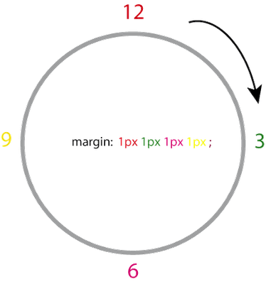

# Forma abreviada (_shortland properties_)
Es posible ahorrar código a la hora de escribir CSS siguiendo la "regla del reloj" que consiste en referenciar las ubicaciones _top_, _rigth_, _bottom_ y _left_, como las 12, 3, 6 y 9 horas, respectivamente y siguiendo el **sentido de giro de las agujas del reloj**, comenzando siempre por la posición _top_. 

### Ejemplos
Tomando la "regla del regloj" abordada en la sección anterior, es posible escribir menor cantidad de código CSS. A continuación, algunos ejemplos de aplicación:  

#### border-width (forma abreviada)
| Esquema                                           | Ejemplo                  |
| ------------------------------------------------- | ---------------------------- |
|  |**1 valor**  `border-width: 1em`   El único valor aplica a todos los bordes.   |
|  | **2 valores**  `border-width: 1em 2em`   El primer valor aplica a los bordes superior e inferior. El segundo valor aplica a los bordes izquierdo y derecho.  |
|  | **3 valores**  `border-width: 1em 2em 3em`   El primer valor aplica al borde superior. El segundo valor, a los bordes izquierdo y el derecho. Finalmente, el tercer valor aplica al borde inferior. |
|  | **4 valores**  `border-width: 1em 2em 3em 4em`   Los cuatro valores aplican a los bordes superior, derecho, inferior e izquierdo respectivamente, siempre en ese orden, es decir, en sentido horario comenzando por el borde superior.|

| Propiedad           | Descripción                  | Valor                                                        |
| ------------------- | ---------------------------- | ------------------------------------------------------------ |
| `border-top-width`    | Anchura del borde superior   | <medida\> \| thin \| **medium** \| thick \| inherit       |
| `border-right-width`  | Anchura del borde derecho    | <medida\> \| thin \| **medium** \| thick \| inherit       |
| `border-bottom-width` | Anchura del borde inferior   | <medida\> \| thin \| **medium** \| thick \| inherit       |
| `border-left-width`   | Anchura del borde izquierdo  | <medida\> \| thin \| **medium** \| thick \| inherit       |
| `border-width`        | Anchura de los cuatro bordes | <medida {1-4}\> \| thin \| **medium** \| thick \| inherit |

_Nota: el valor por defecto de la propiedad aparece resaltado en negrita._

La propiedad `border-width` permite indicar entre uno y cuatro valores, estos pueden ser indistintamente medidas o las palabras clave `thin`, `medium` y `thick`. El número de valores indicado `{1-4}` significa lo siguiente:

* Si se indica **un valor**: Se aplica a los cuatro bordes.
* Si se indican **dos valores**: El primero se aplica al borde superior e inferior, y el segundo al borde izquierdo y derecho.
* Si se indican **tres valores**: El primero se aplica al borde superior, el segundo a los bordes izquierdo y derecho, y el tercero al borde inferior.
* Si se aplican **cuatro valores**: El orden de aplicación es superior, derecho, inferior, izquierdo.

#### border-radius (forma abreviada)

| Esquema                                           | Ejemplo                  |
| ------------------------------------------------- | ---------------------------- |
|  |**1 valor**  `border-radius: 1em`   El único valor aplica a todos las esquinas.   |
|  | **2 valores**   `border-radius: 1em 2em`   El primer valor aplica a las esquinas superior izquierda e inferior derecha, el segundo valor, a las esquinas superior derecha e inferior izquierda.    |
|  | **3 valores**  `border-radius: 1em 2em 3em`   El primer valor aplica a la esquina superior izquierda, el segundo, a las esquinas superior derecha e inferior izquierda, y el tercer valor a la esquina inferior derecha. |
|  | **4 valores**  `border-radius: 1em 2em 3em 4em`   Los cuatro valores aplican a las esquinas superior izquierda, superior derecha, inferior derecha e inferior izquierda, respectivamente, siempre en ese orden, es decir, en el sentido de las agujas del reloj comenzando por la esquina superior izquierda.  |

_Fuente:_ 

* _[Shortland properties](https://developer.mozilla.org/es/docs/Web/CSS/Shorthand_properties)_
* _[Border radius](https://developer.mozilla.org/es/docs/Web/CSS/border-radius)_
