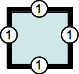

# El modelo de caja

Para comprender qué es una caja en CSS simplemente debés imaginarte un cuadrado o rectángulo. Dicha figura poseerá un determinano ancho y alto, un borde, márgenes, colores, posición, etc. 

El lenguaje CSS trata a todos los elementos como si estuvieran contenidos en cuadrados o rectángulos. Si normalmente al ver una página web no vemos una caja en cada párrafo o en cada imagen, es porque la mayoría de las veces estas cajas no poseen bordes  o bien, son transparentes (valores por defecto). 


El modelo de caja en CSS, yendo desde el contenido hacia afuera, está definido por: 

* El **tamaño de la caja** puede establecerse mediante las propiedades _width_ (ancho) y height (alto).
* **Contenido**: es el texto, la imagen, o _lo que sea_ qué está dentro de la caja. 
* **Padding**: es un **margen interno**, que rodea al contenido que forma parte de la propia caja.
* **Border**: es el **borde externo de la caja** y por tanto, la delimita.
* **Margin**: es el **margen exterior a la caja**, que aunque no forma parte de la caja, deja un espacio entre ésta y los otros elementos que la rodean.
* Los márgenes como el borde pueden definirse para los cuatro lados de la caja mediante las palabras _top_ (arriba), _bottom_ (abajo), _left_ (izquierda), y _right_ (derecha).
* La **posición de la caja** (su ubicación respecto a la página o elementos de la misma) también puede determinarse también mediante las palabras _top_ (arriba), _bottom_ (abajo), _left_ (izquierda), y _right_ (derecha). Sin embargo, el posicionamiento de una caja es un tema relativamente complejo que [será abordado en otra sección](position.md). 


_Los márgenes, tanto interno (padding) como externo (margin), son transparentes. En la figura se le aplica color con fines didácticos_. 

A continuación vamos a profundizar en cada uno de las propiedades básicas de una caja CSS. 

## Márgenes

### padding
### margin

## Borde
El modelo de caja de CSS permite asignar diversos estilos para los bordes: `border-width` para definir el ancho del borde, `border-color` para establecer el color del borde y finalmente  `border-style` para indicar tipo de borde de la caja. 

### `border-width`

Los valores de la anchura de los bordes se pueden indicar mediante una medida o mediante las palabras clave thin (borde delgado), medium (borde normal) y thick (borde ancho):

| Propiedad           | Descripción                  | Valor                                                        |
| ------------------- | ---------------------------- | ------------------------------------------------------------ |
| `border-top-width`    | Anchura del borde superior   | <medida\> \| thin \| **medium** \| thick \| inherit       |
| `border-right-width`  | Anchura del borde derecho    | <medida\> \| thin \| **medium** \| thick \| inherit       |
| `border-bottom-width` | Anchura del borde inferior   | <medida\> \| thin \| **medium** \| thick \| inherit       |
| `border-left-width`   | Anchura del borde izquierdo  | <medida\> \| thin \| **medium** \| thick \| inherit       |
| `border-width`        | Anchura de los cuatro bordes | <medida {1-4}\> \| thin \| **medium** \| thick \| inherit |

_Nota: el valor por defecto de la propiedad aparece resaltado en negrita._

La propiedad `border-width` permite indicar entre uno y cuatro valores, estos pueden ser indistintamente medidas o las palabras clave `thin`, `medium` y `thick`. El número de valores indicado `{1-4}` significa lo siguiente:

* Si se indica **un valor**: Se aplica a los cuatro bordes.
* Si se indican **dos valores**: El primero se aplica al borde superior e inferior, y el segundo al borde izquierdo y derecho.
* Si se indican **tres valores**: El primero se aplica al borde superior, el segundo a los bordes izquierdo y derecho, y el tercero al borde inferior.
* Si se aplican **cuatro valores**: El orden de aplicación es superior, derecho, inferior, izquierdo.


### `border-color`

### `border-style`


### Forma abreviada (_shortland properties_)

#### Bordes
| Esquema                                           | Ejemplo                  |
| ------------------------------------------------- | ---------------------------- |
|  |**1 valor** <br />`border-width: 1em` <br /> El único valor aplica a todos los bordes.   |
|  | **2 valores** <br />`border-width: 1em 2em` <br /> El primer valor aplica a los bordes superior e inferior. El segundo valor aplica a los bordes izquierdo y derecho.  |
|  | **3 valores** <br />`border-width: 1em 2em 3em` <br /> El primer valor aplica al borde superior. El segundo valor, a los bordes izquierdo y el derecho. Finalmente, el tercer valor aplica al borde inferior. |
|  | **4 valores** <br />`border-width: 1em 2em 3em 4em` <br /> Los cuatro valores aplican a los bordes superior, derecho, inferior e izquierdo respectivamente, siempre en ese orden, es decir, en sentido horario comenzando por el borde superior.|


#### Esquinas
| Esquema                                           | Ejemplo                  |
| ------------------------------------------------- | ---------------------------- |
|  |**1 valor** <br />`border-radius: 1em` <br /> El único valor aplica a todos las esquinas.   |
|  | **2 valores** <br /> `border-radius: 1em 2em` <br /> El primer valor aplica a las esquinas superior izquierda e inferior derecha, el segundo valor, a las esquinas superior derecha e inferior izquierda.    |
|  | **3 valores** <br />`border-radius: 1em 2em 3em` <br /> El primer valor aplica a la esquina superior izquierda, el segundo, a las esquinas superior derecha e inferior izquierda, y el tercer valor a la esquina inferior derecha. |
|  | **4 valores** <br />`border-radius: 1em 2em 3em 4em` <br /> Los cuatro valores aplican a las esquinas superior izquierda, superior derecha, inferior derecha e inferior izquierda, respectivamente, siempre en ese orden, es decir, en el sentido de las agujas del reloj comenzando por la esquina superior izquierda.  |


_Fuente:_ 

* _[Shortland properties](https://developer.mozilla.org/es/docs/Web/CSS/Shorthand_properties)_
* _[Border radius](https://developer.mozilla.org/es/docs/Web/CSS/border-radius)_

## Ejemplo de caja
Como no puede ser de otra manera, analicemos un ejemplo real para conocer el modo en que CSS trata a una caja: 

**Código HTML**

```html linenums="1" hl_lines="9"
<!DOCTYPE html>
<html lang="es">
<head>
	<meta charset="UTF-8">
	<title>Modelo de caja CSS</title>
	<link rel="stylesheet" href="caja.css">
</head>
<body>
	<div>Hola! Soy una caja</div>
</body>
</html>
```
**Código CSS**

```css linenums="1"
div {
	/* Altura de la caja */
	height: 200px;
	/* Anchura de la caja */
	width: 200px;
	/* Margen interno de la caja */
	padding: 20px;
	/* Borde de la caja */
	border: 2px solid red; 
	/* Margen externo a la caja */
	margin: 20px;
	/* Color de fondo de la caja */
	background-color: lime;
}
```

!!!info "Comentarios en CSS"
		CSS permite incluir comentarios entre sus reglas y estilos. Los comentarios son contenidos de texto que el diseñador incluye en el archivo CSS para su propia información y utilidad. Los navegadores ignoran por completo cualquier comentario de los archivos CSS, por lo que es común utilizarlos para estructurar de forma clara los archivos CSS complejos.

		El comienzo de un comentario se indica mediante los caracteres `/*` y el final del comentario se indica mediante `*/`, tal y como se muestra en el siguiente ejemplo:

		```css
		/* Este es un comentario en CSS */
		```

		Los comentarios pueden ocupar tantas líneas como sea necesario, pero no se puede incluir un comentario dentro de otro comentario:

		```css
		/* Este es un
		   comentario CSS de varias
		   lineas */
		```

		Aunque los navegadores ignoran los comentarios, su contenido se envía junto con el resto de estilos, por lo que no se debe incluir en ellos ninguna información sensible o confidencial.

		La sintaxis de los comentarios CSS es muy diferente a la de los comentarios HTML, por lo que no deben confundirse:

		```html
		<!-- Este es un comentario en HTML -->
		 
		<!-- Este es un
		     comentario HTML de varias
		     lineas -->
		```


_Fuente de conocimiento:_

* _[aprende-web.net](http://aprende-web.net)_
* _[librosweb.es](https://librosweb.es)_
* _[developer.mozilla.org](https://developer.mozilla.org/es/docs/Web/CSS/CSS_Modelo_Caja/Mastering_margin_collapsing)_