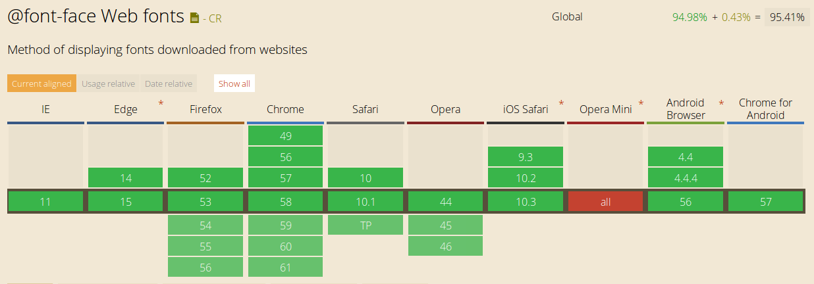
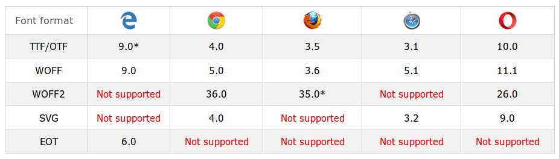

# Las tipografías en el diseño web
En casi todas las páginas webs se incluye texto, en mayor o menor medida. Y es tarea del diseñador web estilizar las tipografías con que se mostrará dicho texto. 

El uso de tipografías en el diseño web siempre fue un problema. En los comienzos de internet, los navegadores sólo mostraban el texto de una página web con las tipografías que el usuario tenía instaladas en su sistema operativo (Windows, Mac, Linux, etc). Aunque esto sigue siendo así, con el tiempo se fueron encontrando soluciones a este problema, que permitieron dar mayor versatilidad a los diseños tipográficos en la web. 

Así, el uso de tipografías en el diseño web ha ido virando del caos inicial, pasando por las _safe web fonts_ hasta llegar a la actual definición `@font-face` de CSS. 

## Safe web fonts
Se trata de **tipos de letra o _fuentes_ que están presentes en la mayoría de los sistemas operativos**. Incluyendo estas fuentes en el diseño web se asegura la máxima compatibilidad entre sistemas operativos y navegadores. 

En el año 1996, Microsoft inició el proyecto [TrueType core fonts for the Web _(archivo)_](https://web.archive.org/web/20020124085641/http://www.microsoft.com/typography/fontpack/default.htm) mediante el cual ofrecía la distribución de un grupo de fuentes (con algunos derechos reservados) para internet. El proyecto finalizó en el año 2002. Dichas fuentes son:

* Andale Mono
* Arial
* Arial Black
* Comic Sans MS
* Courier New
* Georgia
* Impact
* Times New Roman
* Trebuchet MS
* Verdana
* Webdings

Aunque el proyecto terminó hace unos años, el catálogo de fuentes seguras quedó establecido, con [algunas fuentes más](https://www.w3schools.com/cssref/css_websafe_fonts.asp) que se sumaron luego. Y al día de hoy, muchos diseñadores las siguen usando. 

Para definir el uso de una fuente segura es necesario el siguiente fragmento de código CSS: 

```css
/* Utilizamos la fuente */
body {
	font-family: SafeWebFont;
}
```

!!!note "Limitaciones de las fuentes seguras"
		Sin negar que las fuentes seguras constituyen un intento de solución (en términos de estandarización) al problema de la tipografía en el diseño web, se trata de una solución limitada, puesto que obliga a todos los sitios webs a emplear las mismas fuentes. 


## Las fuentes para la web o webfonts
Las aparición de las _hojas de estilo en cascada o CSS_ permitieron el uso de cualquier tipo de fuente tipográfica para el diseño web, gracias a la regla CSS `@font-face`. Dicha regla constituyó desde su lanzamiento, una propuesta superadora a las _safe web fonts_. 

La sintaxis de la misma es la siguiente: 

```css
/* Definimos la fuente */
@font-face {
	font-family: nombreDeMiFuente;
	src: url(fuente.woff);
}

/* Utilizamos la fuente */
body {
	font-family: nombreDeMiFuente;
}
```

Sin embargo, la regla `@font-face` no es igualmente soportada por las distintas versiones de los navegadores.  A continuación, una tabla comparativa de la compatibilidad de esta regla según los navegadores más populares: 


_Tomado de: [caniuse.com](https://caniuse.com/#feat=fontface)_

### Formatos de archivos para webfonts
Si bien la regla `@font-face` puede utilizarse con cualquier tipo de fuente, su uso se extendió al incluirse las llamadas _webfonts_ o fuentes diseñadas exclusivamente para la web. Existen diferentes tipos de _webfonts_, cada una con soporte variable en cada tipo de navegador, siendo la de tipo **WOFF**, la que al momento de escribir este documento es considerada como el formato estándar de _webfont_. Otros tipos de archivo para _webfonts_ son: 

* TTF (True Type Format)
* OTF (Open Type Font)
* SVG Font
* EOT (Embedded Open Type)
* WOFF (Web Open Format)
* WOFF2 (Web Open Format, versión 2)

En el siguiente cuadro pueden verse los distintos formatos de archivo de _webfonts_ y la compatibilidad que presentan con los navegadores más populares. Los números indican a partir de cuál versión del navegador el formato de fuente es soportado: 


_Tomado de: [w3schools.com](https://www.w3schools.com/css/css3_fonts.asp)_