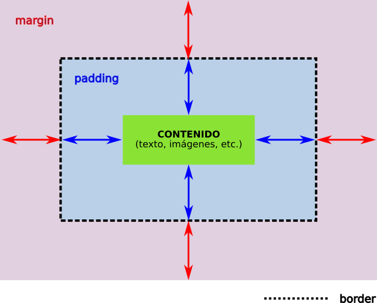

Es posible definir márgenes tanto internos (padding) como externos (margin) para una caja CSS: 

### padding (margen interno)
Hace referencia al espaciado del contenido respecto de los bordes de la caja. 

### margin (margen externo)
Hace referencia al espaciado externo de la caja