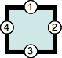

# Forma abreviada (_shorthand properties_)
Es posible ahorrar código a la hora de escribir CSS siguiendo la "regla del reloj" que consiste en referenciar las ubicaciones _top_, _rigth_, _bottom_ y _left_, como las 12, 3, 6 y 9 horas, respectivamente y siguiendo el **sentido de giro de las agujas del reloj**, comenzando siempre por la posición _top_. 

### Ejemplos
Tomando la "regla del reloj", es posible escribir menos cantidad de código CSS. A continuación, algunos ejemplos de aplicación:  

#### Forma abreviada general
A continuación se exhibe el modo de emplear la notación abreviada _shortland_ para la propiedad `border-width` del modelo de caja. No obstante es igualmente válida  para otras propiedades del borde de una caja, como `border-style`y `border-color`, así como para otras propiedades CSS como `background`, `font`, `padding` y `margin`.

| Esquema                                           | Ejemplo                  |
| ------------------------------------------------- | ---------------------------- |
|  |**1 valor**  `border-width: 1em`   El único valor aplica a todos los bordes.   |
|  | **2 valores**  `border-width: 1em 2em`   El primer valor aplica a los bordes superior e inferior. El segundo valor aplica a los bordes izquierdo y derecho.  |
|  | **3 valores**  `border-width: 1em 2em 3em`   El primer valor aplica al borde superior. El segundo valor, a los bordes izquierdo y el derecho. Finalmente, el tercer valor aplica al borde inferior. |
|  | **4 valores**  `border-width: 1em 2em 3em 4em`   Los cuatro valores aplican a los bordes superior, derecho, inferior e izquierdo respectivamente, siempre en ese orden, es decir, en sentido horario comenzando por el borde superior.|

#### Forma abreviada para border-radius
El siguiente ejemplo es un caso particular de forma abreviada, que contempla las esquinas del modelo de caja. 

| Esquema                                           | Ejemplo                  |
| ------------------------------------------------- | ---------------------------- |
|  |**1 valor**  `border-radius: 1em`   El único valor aplica a todos las esquinas.   |
|  | **2 valores**   `border-radius: 1em 2em`   El primer valor aplica a las esquinas superior izquierda e inferior derecha, el segundo valor, a las esquinas superior derecha e inferior izquierda.    |
|  | **3 valores**  `border-radius: 1em 2em 3em`   El primer valor aplica a la esquina superior izquierda, el segundo, a las esquinas superior derecha e inferior izquierda, y el tercer valor a la esquina inferior derecha. |
|  | **4 valores**  `border-radius: 1em 2em 3em 4em`   Los cuatro valores aplican a las esquinas superior izquierda, superior derecha, inferior derecha e inferior izquierda, respectivamente, siempre en ese orden, es decir, en el sentido de las agujas del reloj comenzando por la esquina superior izquierda.  |

_Fuente:_ 

* _[Shortland properties](https://developer.mozilla.org/es/docs/Web/CSS/Shorthand_properties)_
* _[Border radius](https://developer.mozilla.org/es/docs/Web/CSS/border-radius)_
