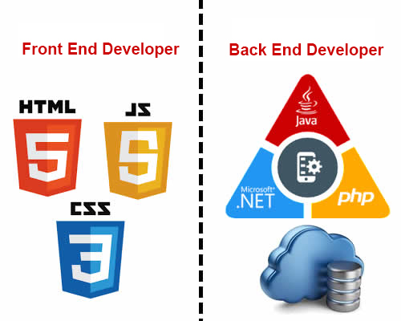

# Las tecnologías de la web

En el proceso de creación de un sitio web intervienen varias disciplinas. Por ejemplo, las relacionadas con el diseño de [interfaz de usuario (UI)](https://es.wikipedia.org/wiki/Dise%C3%B1o_de_interfaz_de_usuario), el diseño de [experiencia de usuario (UX)](https://es.wikipedia.org/wiki/Experiencia_de_usuario), la programación, el modelado de bases de datos, la [optimización del sitio para buscadores (SEO)](https://es.wikipedia.org/wiki/Posicionamiento_en_buscadores), [análisis web](https://es.wikipedia.org/wiki/An%C3%A1lisis_web), la administración de sistemas y seguridad informática, etc. 

Junto al auge de internet aparecieron nuevos profesionales enfocados en un área particular del proceso de creación de un sitio web: 
* **desarrollador web** a quien está encargado del diseño de base de datos y programación, es decir, normalmente se ocupa únicamente del funcionamiento del software 
* **diseñador web** a quien se ocupa del aspecto final de la página
* **webmaster** a la persona encargada de integrar ambas partes aunque, en ocasiones, el webmaster también se encarga de actualizar los contenidos de la página.

En los últimos años aparecieron nuevas definiciones vinculadas a las _tareas que realizan los profesionales_ involucrados en la creación de sitios webs:

* **Desarrollador _front-end_**  vinculado con todos los aspectos relacionados con la visualización del sitio y su interacción con el navegante
* **Desarrollador _back-end_** responsable de la administración del sitio, programación del lado del servidor y el procesamiento de los datos ingresados por el usuario. 
* **Desarrollador _full-stack_** quien se ocupa por igual del _front-end_ y el _back-end_ de un sitio web. 

# Diseño web

En el ámbito del desarrollo web destacan tres lenguajes: **HTML**, **CSS** y **Javascript**, donde los dos primeros son lenguajes de marcado y el último, de programación.  Para comprender mejor que funcion cumple cada uno de ellos a una página web, haremos una comparación: 

|                | HTML                                     | CSS                                      | JS                                       |
| -------------- | ---------------------------------------- | ---------------------------------------- | ---------------------------------------- |
| Descripción    | **H**yper**T**ext **M**arkup **L**anguage (Lenguaje de Marcas de Hipertexto) | **C**ascading **S**tyle **S**heets (Hojas de Estilo en Cascada) | **J**ava**S**cript                       |
| Función        | Constituye la estructura de una página web. *(Podríamos compararlo con el esqueleto de una persona)*. | Se encarga de la apariencia de una página web: colores, tipo y tamaño de letras, fondos, etc. *(Resulta útil compararlo con la vestimenta y accesorios de moda que podría utilizar una persona)*. | Establece la respuesta de la página frente a las acciones del usuario. *(Se podría comparar con el comportamiento de una persona)*. |
| Versión actual | 5                                        | 3                                        | 6                                        |

En el presente curso nos introducieremos en el *diseño web* o *front end*, particularmente, en el estudio de la multitud de posibilidades que nos ofrece CSS a la hora de aplicar estilo las páginas webs. 

Para ello comenzaremos con fundamentos de HTML, para luego experimentar la potencia de las hojas de estilo en cascada. 