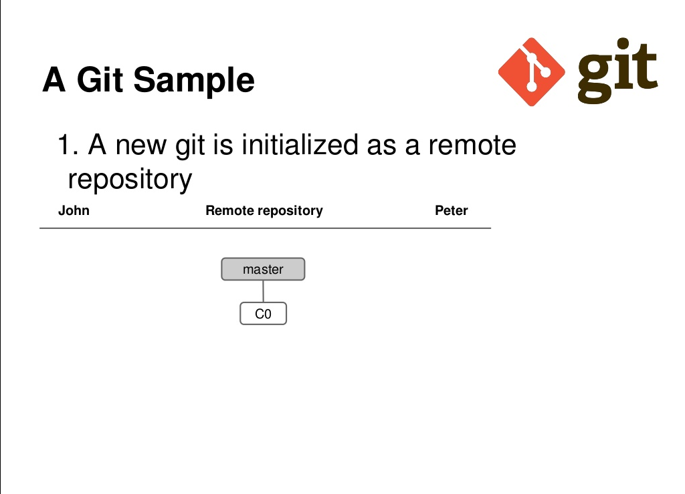
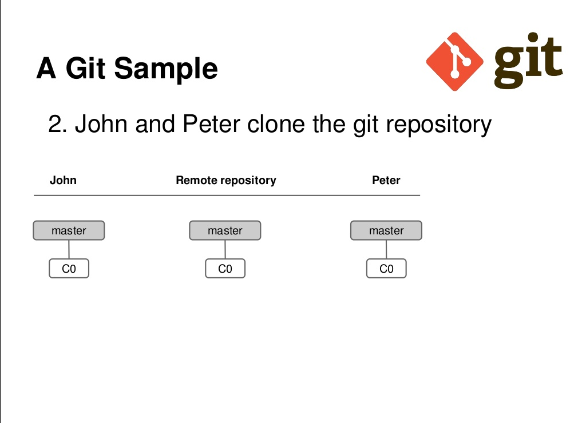
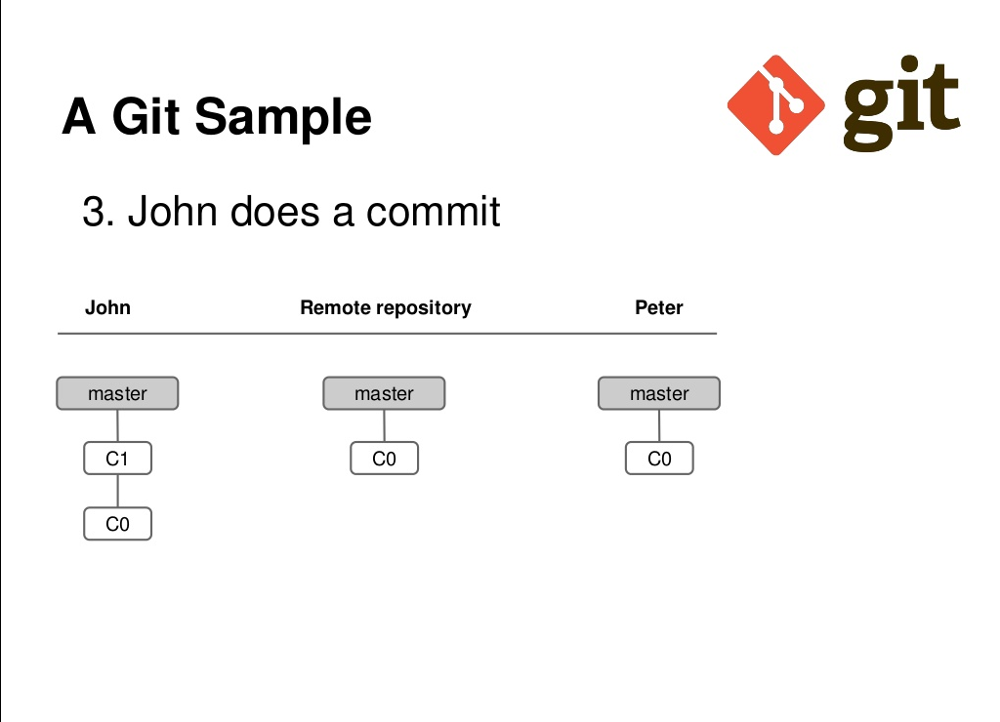
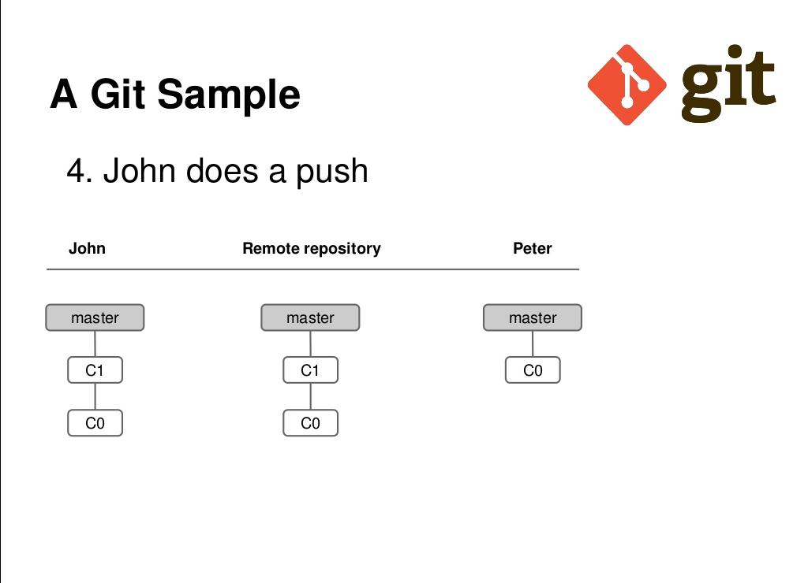
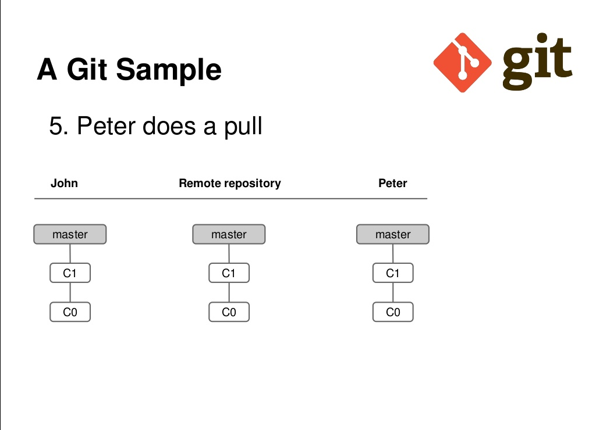
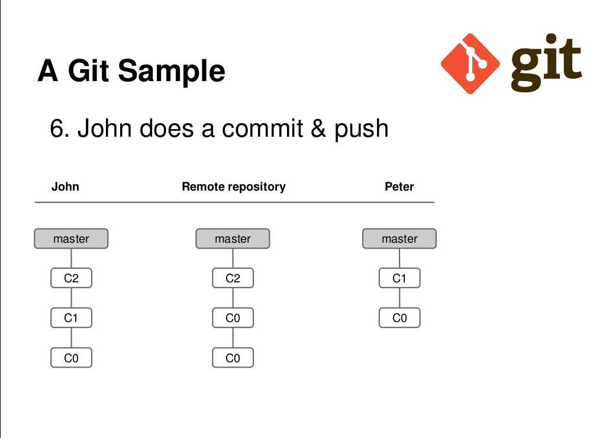
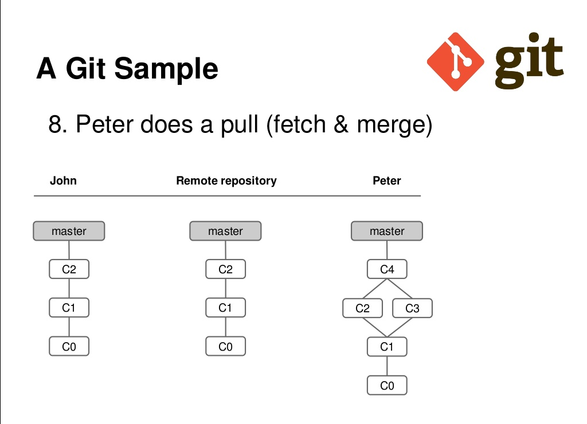
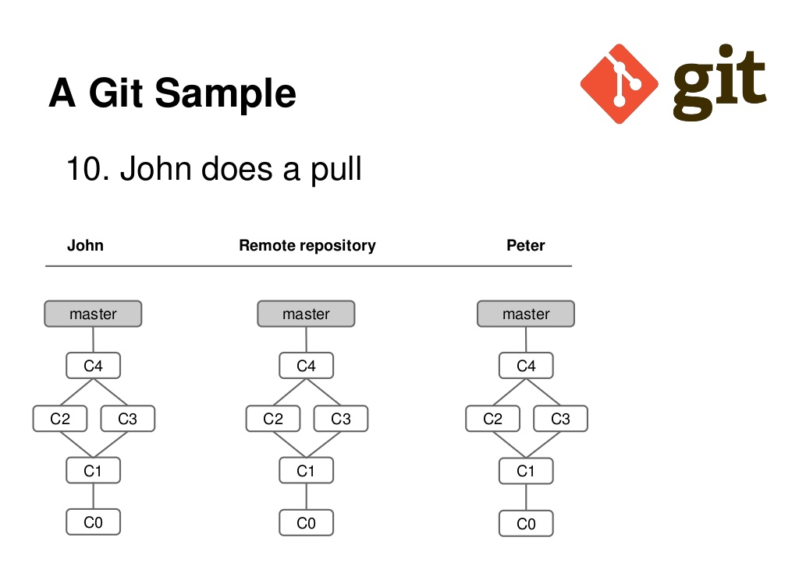

Tomado de "Starting with Git & GitHub", Nicolás Tourné. Diponible en [https://es.slideshare.net/nicotourne/starting-with-git-git-hub-27464735](https://es.slideshare.net/nicotourne/starting-with-git-git-hub-27464735)

