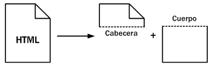
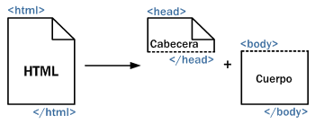

# Introducción a HTML 

**HTML es un lenguaje de marcado**. Es decir, a través de ciertas marcas o **etiquetas**, es posible indicar al navegador (Chrome, Firefox, Internet Explorer -Edge-, Opera, Safari, etc.) cómo está estructurada un documento HTML o página web. 

!!! info ""
    Las etiquetas HTML pueden escribirse en mayúsculas o en minúsculas, sin embargo es recomendable escribirlas siempre en minúsculas. 

## Anatomía de una etiqueta
Como se dijo, HTML es un lenguaje de etiquetas (también llamado lenguaje de marcado) y las páginas web están formadas por cientos o miles de pares de etiquetas.

Las etiquetas se usan para indicar las diferentes secciones que componen un documento digital, marcando el inicio y el final de cada sección.

La estructura típica de una etiqueta es: 

```html
<SoyUnaEtiqueta>(Acá iría algo como texto, imagen, video, etc.)</SoyUnaEtiqueta>
```

Entonces: 

* Una etiqueta está contenida entre los signos de _menor que_ (`<`) y _mayor que_ (`>`).
* En general las etiquetas están formadas por pares
* Exite una etiqueta de apertura (`<SoyUnaEtiqueta>`)  y otra de cierre (`</SoyUnaEtiqueta>`). 

Casi todas las etiquetas soportan el uso de **atributos** que no son más que opciones adicionales con las que cuenta cada tipo de etiqueta. Su sintaxis es: 

```html
<SoyUnaEtiqueta atributo="valor">(...Algo...)</SoyUnaEtiqueta>
```
Si ahora aplicamos todas estas nociones aprendidas a un ejemplo de etiqueta HTML: 


## Estructura del documento
Las páginas HTML se dividen en dos partes: la **cabecera** y el **cuerpo**. La cabecera incluye información sobre la propia página, como por ejemplo su título y su idioma. El cuerpo de la página incluye todos sus contenidos, como párrafos de texto e imágenes.



Si ahora incluimos las etiquetas que definen la estructura de un documento HTML, tenemos que: 



* El documento queda delimitado entre las etiquetas `html`. 
* La cabecera queda definida entre las etiquetas`head` y contiene todo lo que el usuario no ve en su pantalla.
* El cuerpo está comprendido entre las etiquetas `body` y contiene todo lo que el usuario ve en su pantalla. 


Llegó la hora del código. ¡Manos a la obra! 

### Ejemplo 1
Abrí el editor de texto y transcribí el siguiente código: 

```html linenums="1"
<!DOCTYPE html>
<html>
  <head>
    <title>Ejemplo 1</title>
  </head>
  <body>
    ¡Hola mundo!
  </body>
</html>
```

Guardalo con el nombre de `ejemplo_01.html`. Luego, abrí el archivo con tu navegador.

!!! info "¿Qué hemos hecho?"
    En este ejemplo hemos creado nuestro primer documento HTML. En el mismo, podrás apreciar unas líneas de código que representan la estructura básica de un documento HTML. 

??? question "¿Cuál es la función de la etiqueta `DOCTYPE`?"
    La etiqueta `DOCTYPE` (tipo de documento) se coloca al inicio del documento (por única vez) y su función es indicar al navegador el tipo de documento. En nuestro ejemplo, indica que se trata de un documento HTML: `<!DOCTYPE html>` 


??? question "¿Qué pasó con texto encerrado por la etiqueta `title`?"
    Cómo lo mencionamos antes, todo lo que está dentro de la etiqueta `head` no es visible en la pantalla del usuario. ¡Y la etiqueta `title` se encuentra dentro de la etiqueta `head`!. Sin embargo en este caso excepcional, aunque el texto no es visible en la ventada del navegador, sí se visualiza en la barra de título del mismo. ¡Comprobalo!

### Ejemplo 2 
Copiá el siguiente código en un nuevo archivo: 

```html linenums="1"
<!DOCTYPE html>
<html>
  <head>
    <title>Ejemplo 2</title>
  </head>
  <body>
    <!-- ¡Hola mundo! --> 
    ¡Esta es mi segunda página!
  </body>
</html>
```
Guarda el archivo con el nombre `ejemplo_02.html` y abrilo con el navegador.

!!! info "¿Qué hemos hecho"
    Hemos creado un documento HTML que incluye un comentario HTML. Éstos son visibles sólo si inspeccionamos el código de una página, pero no son visibles en la pantalla del usuario. Los comentarios son útiles para los desarrolladores, como un medio para realizar anotaciones. 

??? question "¿Cuál es la sintaxis de un comentario HTML?"
    Un comentario HTML siempre comienza con los símbolos `<!--` y finaliza con los símbolos `-->`. 